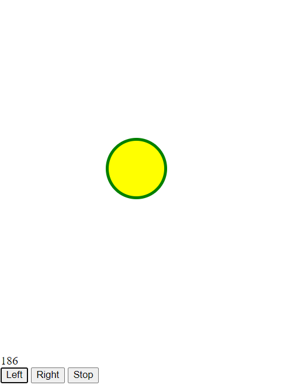

# What's In My Freezer?

What do you have in your freezer? 
Is it enough to make a meal? 
Can you get to the right ingredients? Or do you need to move food around in your freezer? 
How quickly can you make your meals? 
Will you run out of time? Will you run out of ingrediants? 

**What's in your freezer?**

## Notes
* The starting point of the code is to move an object on the screen to the left and right. 
* This project is written in javascript and can be served with Node. (But it runs as pure javascript also.)
